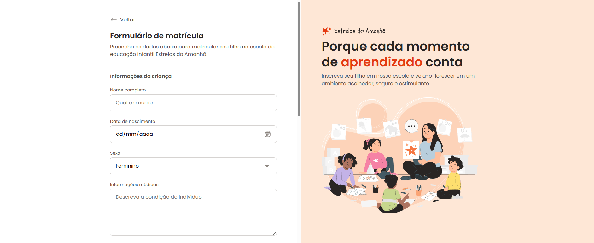

# Estrelas do Amanhã ⭐


*Preview da interface do formulário de matrícula.*

Projeto desenvolvido como parte do curso **Full-Stack da Rocketseat**, com foco no estudo de **HTML5**, **CSS3** e na construção de **formulários avançados**, simulando um ambiente real de matrícula escolar.

---

## 🚀 Tecnologias Utilizadas
- **HTML5**
- **CSS3**

---

## 🎯 Objetivo do Projeto
O objetivo deste projeto é praticar a construção de um formulário de matrícula para uma escola de educação infantil, aplicando conceitos avançados de **HTML Forms** e **CSS Grid**.

Foram explorados diferentes tipos de campos de entrada, controles de seleção e organização visual do formulário, buscando uma estrutura clara, acessível e alinhada a interfaces profissionais.

---

## 📁 Como visualizar o projeto

### 1. Clone o repositório
```bash
git clone https://github.com/muddyorc/estrelas_do_amanha.git
